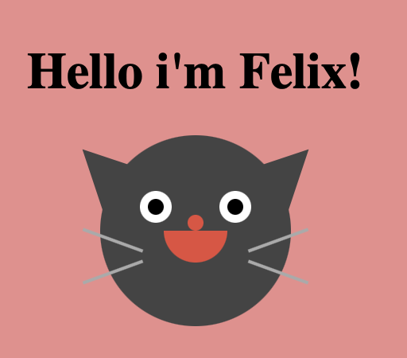

# Cat

Un chat mignon et minimaliste réalisé entièrement en HTML et CSS. Parfait pour vos projets liés aux animaux ou simplement pour apprendre certaines techniques CSS.
…

## Fonctionnalités

- Design minimaliste : Une représentation simplifiée d'un chat, facile à intégrer dans n'importe quel projet.
- Animation de clignotement : Les yeux du chat clignotent pour donner un peu de vie à la conception.

## Comment l'utiliser ?

1. clonez le repo.
2. Ouvrez le fichier index.html dans votre navigateur.

## Personnalisation

- Couleurs : Modifiez les valeurs de couleur dans le fichier styles.css pour personnaliser l'apparence du chat selon vos préférences.
- Taille : Le chat est conçu avec des valeurs en pixels, mais vous pouvez facilement adapter sa taille en ajustant les dimensions dans le fichier styles.css.

## Contribution

Si vous avez des suggestions ou des améliorations, n'hésitez pas à ouvrir une issue ou à soumettre une pull request. Toutes les contributions sont les bienvenues!